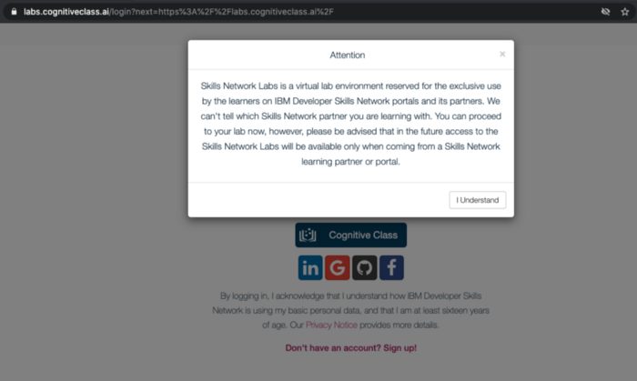
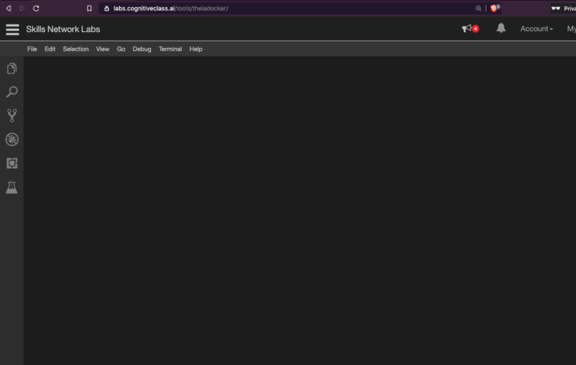
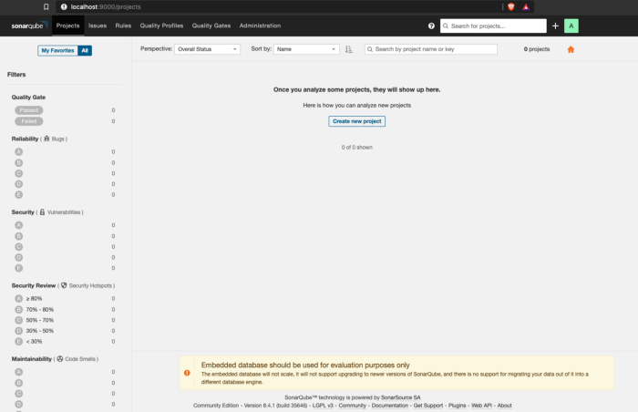
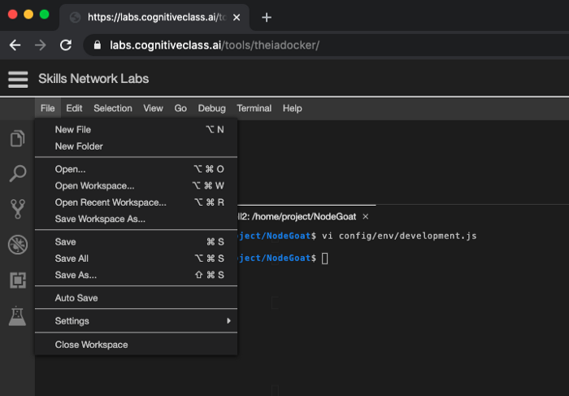

# Lab 1 - Get Started with SonarQube

Description goes here.

This section is comprised of the following steps:

- [Lab 1 - Get Started with SonarQube](#lab-1---get-started-with-sonarqube)
  - [About SonarQube](#about-sonarqube)
  - [Open a Client Terminal](#open-a-clientterminal)
  - [Installation with Docker](#installation-withdocker)
  - [[Optional] Installation on MacOS](#optional-installation-onmacos)
  - [[Optional] Open SonarQube Console](#optional-open-sonarqube-console)
  - [Get NodeGoat App](#get-nodegoatapp)
  - [Setup NodeGoat Project in SonarQube](#setup-nodegoat-project-in-sonarqube)
  - [Setup the SonarQube Scanner CLI](#setup-the-sonarqube-scannercli)
  - [Run a Basic SonarQube Scan](#run-a-basic-sonarqube-scan)
  - [Conclusion](#conclusion)

## About SonarQube

Security is an intimidating topic. Some parts of security are really advanced and hard, but there is a few very simple best practices to follow to secure your application. One of those is to include a tool in your DevOps pipeline, to automatically scan for vulnerabilities in your code each time you build. [OpenSCAP](https://www.open-scap.org/) is one such project, and [SonarQube](https://www.sonarqube.org) is another. Such a code scan is part of what is called Static Application Security Testing (SAST).

[SonarQube](https://www.sonarqube.org) is a leading automatic code review tool to detect bugs, vulnerabilities and code smells in your code. To run secure microservices and applications, it is important to fully automate security testing of your application with Application Security Testing or AST.


You can roughly distinguish three to four forms of Application Security Testing (AST):
* **Static Application Security Testing (SAST)** does an analysis of vulnerabilities in your code, also known as white-box testing and finds roughly about 50% of issues.
* **Dynamic Application Security Testing (DAST)**, does not have access to your code and tests for vulnerabilities in the application flow, also known as black-box testing and is great for End-to-End (E2E) testing and pentesting, finding about 20% of issues,
* **Interactive Application Security Testing (IAST)**, distinguishing passive and active IAST, is considered a mix of SAST and DAST with the best coverage of issues. It is sometimes also named grey-box testing, because it places IAST monitoring agents inside the application, integrates really well with CI/CD pipelines and is seen to shift-left testing,
* **Software Component Analysis (SCA)** testing is another way to analyze vulnerabilities in dependencies and libraries and could be included here.

In this lab, you will use SonarQube on Docker to run a SAST scan against the source code of a web app called NodeGoat. The [NodeGoat project](https://github.com/OWASP/NodeGoat) is a reference environment created by OWASP to learn how [OWASP Top 10 security risks](https://owasp.org/www-project-top-ten/) apply to web applications developed using Node.js. The [Open Web Application Security Project (OWASP)](https://owasp.org/) is an online community that produces freely-available articles, methodologies, documentation, tools, and technologies in the field of [web application security](https://en.wikipedia.org/wiki/Web_application_security).

Steps on localhost: 
* Open a Client Terminal
* Installation with Docker,
* [Optional] Installation on MacOS,
* Open SonarQube Console,
* Get NodeGoat App,
* Create NodeGoat Project in SonarQube,
* Setup the SonarQube Scanner CLI,
* Run a Basic SonarQube Scan,

## Open a Client Terminal

This article was tested using the `Theia - Cloud IDE (With Docker)` client terminal from [labs.cognitiveclass.ai](https://labs.cognitiveclass.ai) as well as on macOS Catalina version 10.15.6. With the Theia environment you will now have access to a UI or browser, so skip the UI based options in the article and stick with the terminal, which for the purpose of this article, I recommend regardless. ;-) The value of sticking to the CLI commands, is that those will be easy to automate later as part of the developer adagium that `Everything is Code`.

The [CognitiveClass.ai](https://cognitiveclass.ai) is probably the most feature-rich, self-guided, learning environment where you can earn badges in a range of topics from Kubernetes, OpenShift to Machine Learning.

To access a free client terminal environment, go to [labs.cognitiveclass.ai](https://labs.cognitiveclass.ai),




Sign up and log in with your social account or signup for a free Cognitive Class account,


Once logged in, select the `Theia - Cloud IDE (With Docker)` environment,


This will load the Theia IDE, a free open source cloud IDE environment,



Open a new client terminal from the Terminal menu > New Terminal.


## Installation with Docker
 
Using Docker to install SonarQube, you can optionally create storage volumes with Docker to prevent the loss of information,

```console
docker volume create --name sonarqube_data
docker volume create --name sonarqube_extensions
docker volume create --name sonarqube_logs
```

You can verify the volumes were created successfully,

```
docker volume ls
```

which outputs,

```
$ docker volume ls
DRIVER              VOLUME NAME
local               sonarqube_data
local               sonarqube_extensions
local               sonarqube_logs
```

Then run the SonarQube container,

```console
docker run -d --name my-sonarqube -p 9000:9000 -v sonarqube_data:/opt/sonarqube/data -v sonarqube_extensions:/opt/sonarqube/extensions -v sonarqube_logs:/opt/sonarqube/logs sonarqube
```

## [Optional] Installation on MacOS

I recommend to use Docker for this tutorial (see previous step) but if you want to install SonarQube directly on localhost on macOS, you can use homebrew,

```
brew install sonar
brew install sonar-scanner
sonar start
```

Open the SonarQube console,

```
open http://localhost:9000/projects
```

## [Optional] Open SonarQube Console

In the [labs.cognitiveclass.ai terminal](https://labs.cognitiveclass.ai/tools/theiadocker/), you do not have access to a browser. If you’re running SonarQube in a windows environment with access to a browser, e.g. MacOS, you can open the SonarQube console in a new browser tab at [http://localhost:9000/projects](http://localhost:9000/projects), login with System Administrator credentials (login=admin, password=admin).

```
open http://localhost:9000/projects
```



## Get NodeGoat App

Clone and install the dependencies for the NodeGoat app,

```
git clone https://github.com/OWASP/NodeGoat.git
cd NodeGoat
npm install --save
```

The NodeGoat app uses a MongoDB. Edit the config file located at `config/env/development.js` with the file editor. In the `Theia Cloud IDE` you can open the file via the top menu `> File > Open`, then browse to the `config/env folder`,



Select the file development.js, and click Open,


Or if you have access to `vi`,

```
vi config/env/development.js
```

Uncomment the following line at line number 8,

```
db: "mongodb://localhost:27017/nodegoat",
```


From the top menu, click `> File > Save`, and close the file again.

Install MongoDB with Docker,

```
docker run --name my-mongo -d -p 27017:27017 mongo
docker exec -it  my-mongo bash
> mongo
> show dbs
> use mydb
> db.people.save({ firstname: "Jane", lastname: "Doe" })
> db.people.find({ firstname: "Jane" })
> exit
# exit
```

Populate the Mongo database with seed data, and start the NodeGoat app,

```
npm run db:seed
npm start
```

[Optional] If you have access to a windows based environment, you can open the browser UI for the NodeGoat app at [http://localhost:4000](http://localhost:4000),

```
open http://localhost:4000
```

and login with credentials `admin:Admin_123`.


Exit running the NodeGoat app with `CTRL-<C>`, optionally clear your terminal.

```
clear
```

## Setup NodeGoat Project in SonarQube

Make sure SonarQube is running,

```
$ docker container ls
CONTAINER ID    IMAGE    COMMAND    CREATED    STATUS     PORTS     NAMES
bb0f317fc67c    mongo    "docker-entrypoint.s…"   3 minutes ago       Up 3 minutes    0.0.0.0:27017->27017/tcp   my-mongo
8ba100b7a3f1    sonarqube     "bin/run.sh bin/sona…"   17 minutes ago    Up 17 minutes     0.0.0.0:9000->9000/tcp    my-sonarqube
```

Or,

```
$ docker ps -a
CONTAINER ID   IMAGE     COMMAND    CREATED   STATUS   PORTS   NAMES
505b6f7da982   mongo     "docker-entrypoint.s…"   3 minutes ago       Up 3 minutes    0.0.0.0:27017->27017/tcp  my-mongo
c885a4bdcda2   sonarqube "bin/run.sh bin/sona…"   7 minutes ago       Up 7 minutes    0.0.0.0:9000->9000/tcp    my-sonarqube
```

Create a new SonarQube project using the Web API, with display name and project key `my-nodegoat`,


```
$ curl -u admin:admin -X POST 'http://localhost:9000/api/projects/create?name=my-nodegoat&project=my-nodegoat'

{"project":{"key":"my-nodegoat","name":"my-nodegoat","qualifier":"TRK","visibility":"public"}}
```

Generate a user access token for your new project,

```
$ curl -u admin:admin -X POST 'http://localhost:9000/api/user_tokens/generate' -d "name=sca-lab-token"

{"login":"admin","name":"sca-lab-token","token":"f0d226f80f6b190e6f1accf2623e244775eb204e","createdAt":"2020-09-16T11:54:11+0000"}
```

Or to create the project in the SonarQube web console, under `projects` click the `plus` icon in the top right corner to create a new project, called `my-nodegoat` with display name and key `my-nodegoat` and click `Set Up`.


In the `Analyze your project` step, under `Provide a token` select `Generate a token` and enter a name for a token called `sca-lab-token`, click `Generate`,


Click Continue,


The user access token that is generated is valid for the currently active user: d51a0ffcf2eece22881537afc6f4559cf43bc633.

The NodeGoat project we are analyzing is written in JavaScript, Node.js and HTML.

As the project's main language, select `Other`.


As your OS, select the OS you are running under, e.g. `macOS` or `Linux`, depending on the OS of the client to run the scanner,


After you select the client OS, the console will provide you with a download option for the scanner and the alternative command to run the scanner using Docker.


## Setup the SonarQube Scanner CLI

The preferred way to run SonarQube Scanner CLI in this tutorial is by using the Docker image (as described below), but you can also run SonarQube directly on local host.

Configure a SonarQube scan by including a properties file in the repository of your project to be scanned. In the NodeGoat directory, create a `sonar-project.properties` file,

```
cat > sonar-project.properties <<EOF
sonar.projectKey=my-nodegoat
sonar.projectName=my-nodegoat
EOF

ls -al
```

To use SonarQube Scanner CLI using Docker as recommended, skip the next steps and jump to the next section.

[Optional] An alternative way to run SonarQube is to install the CLI on your client. On Mac OSX, you can use Homebrew,

```
brew install sonar-scanner
```

On Linux, use the following command,

```
wget https://binaries.sonarsource.com/Distribution/sonar-scanner-cli/sonar-scanner-cli-4.4.0.2170-linux.zip
unzip sonar-scanner-cli-4.4.0.2170-linux.zip
echo 'export PATH=$HOME/sonar-scanner-4.4.0.2170-linux/bin:$PATH' > .bash_profile
source .bash_profile
sonar-scanner --version
```

## Run a Basic SonarQube Scan

Find the IP Address on your client. On Linux,

```
$ hostname -I | awk '{print $1}'
172.30.84.168
```

On Mac OSX,

```
% ipconfig getifaddr en0
192.168.1.15
```

Set the HOST environment variable,

```
SONARQUBE_URL=http://192.168.1.15:9000
```

Run the scanner from the Docker image,

```
$ docker run --rm -e SONAR_HOST_URL=${SONARQUBE_URL} -e "SONAR_PROJECT_KEY=my-nodegoat" -v $(pwd):/usr/src sonarsource/sonar-scanner-cli

...
INFO: ANALYSIS SUCCESSFUL, you can browse http://192.168.1.15:9000/dashboard?id=my-nodegoat
INFO: Note that you will be able to access the updated dashboard once the server has processed the submitted analysis report
INFO: More about the report processing at http://192.168.1.158:9000/api/ce/task?id=AXSX6iOzmn3tnrbCoy-H
INFO: Analysis total time: 12:54.949 s
INFO: --------------------------------------------------------------
INFO: EXECUTION SUCCESS
INFO: --------------------------------------------------------------
INFO: Total time: 23.305s
INFO: Final Memory: 15M/120M
INFO: --------------------------------------------------------------
```

You can retrieve the full results via the CLI,

```
curl -u admin:admin "http://localhost:9000/api/issues/search"
```

[Optional] If you have access to the browser UI, open the report in a browser,

```
open ${SONARQUBE_URL}/dashboard?id=my-nodegoat
```


Or view the Projects dashboard,


SonarQube defines three types of issues: Bug, Vulnerability and Code Smell. To search for issues of type `Bug`,

```
curl -u admin:admin "http://localhost:9000/api/issues/search" -d "types=BUG" > issues-bugs.yaml
```

Which should look something as follows,

```
{
  "total":97,
  "p":1,
  "ps":100,
  "paging":{
    "pageIndex":1,
    "pageSize":100,
    "total":97
  },
  "effortTotal":263,
  "debtTotal":263,
  "issues":[
    {
      "key":"AXSX6mZYjwpB72MkzTMq",
      "rule":"Web:BoldAndItalicTagsCheck",
      "severity":"MINOR",
      "component":"my-nodegoat:app/views/tutorial/layout.html",
      "project":"my-nodegoat",
      "line":63,
      "hash":"b836bb9b9eac054755bec4df12874ec8",
      "textRange":{
        "startLine":63,
        "endLine":63,
        "startOffset":49,
        "endOffset":63
      },
      "flows":[],
      "status":"OPEN",
      "message":"Replace this <i> tag by <em>.",
      "effort":"2min",
      "debt":"2min",
      "author":"afry@virtru.com",
      "tags":[],
      "creationDate":"2019-03-03T15:43:28+0000",
      "updateDate":"2020-09-16T17:06:21+0000",
      "type":"BUG",
      "organization":"default-organization"
    }
  ],
  "components":[
    {
      "organization":"default-organization",
      "key":"my-nodegoat:app/views/tutorial/a4.html",
      "uuid":"AXSX6jXsjwpB72MkzTKZ",
      "enabled":true,
      "qualifier":"FIL",
      "name":"a4.html",
      "longName":"app/views/tutorial/a4.html",
      "path":"app/views/tutorial/a4.html"
    }
  ]
}
```

[Optional] Or browse your project scan in the console,


and select `Bugs`,


## Conclusion

You are awesome! In the following part 2, I will step through how to integrate the above source code scan for vulnerabilities into a Tekton pipeline for automated CI/CD. Please clap, follow and share to show your appreciation. Thank you all.