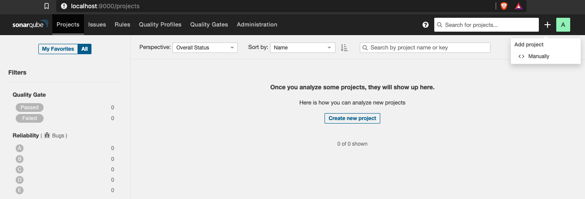

# Lab 1 - Get Started

Description goes here.

This section is comprised of the following steps:

- [Lab 1 - Get Started](#lab-1---get-started)
  - [Get Source Code](#get-source-code)
  - [Create a SonarQube Project](#create-a-sonarqube-project)
  - [Scan the Source Code](#scan-the-source-code)

## Get Source Code

The NodeGoat app requires a MongoDB installation. 

```
docker run --name my-mongo -d -p 27017:27017 mongo
docker exec -it  my-mongo bash
mongo
show dbs
use mydb
db.people.save({ firstname: "Jane", lastname: "Doe" })
db.people.find({ firstname: "Jane" })
exit
exit
```

Clone and run the NodeGoat app,

```
git clone https://github.com/OWASP/NodeGoat.git
cd NodeGoat
npm install
```

Edit the file config/env/development.js and uncomment the following line,

```
db: "mongodb://localhost:27017/nodegoat",
```

Populate the Mongo database with seed data,

```
npm run db:seed
npm start
```

Open the app at http://localhost:4000, and login with admin:Admin_123.

## Create a SonarQube Project

Open a browser and go to http://localhost:9000/projects, login with the default SonarQube system administrator credentials (login=admin, password=admin).

1. Click the `Create a new project` button, 



1. For `Project Key` and `Display Name` enter `my-nodegoat`,


1. Click the `Setup` button
1. Under `Provide a token` select the `Generate a token` option, and `Enter a name for your token`: `my-nodegoat-token`,


1. Click the `Generate` button,


1. And click `Continue`, 


1. To `Run the analysis on your project` select `Other` for the project's main language, which for NodeGoat is JavaScript, for OS select macOS.
1. The `sonar-scanner` execution code example will display.

## Scan the Source Code

Open a terminal window and make sure to change the current directory to the NodeGoat project,

```
% cd NodeGoat
```

Run the sonar-scanner using the project `my-nodegoat` and the generated `token`,

```
% sonar-scanner \
  -Dsonar.projectKey=my-nodegoat \
  -Dsonar.sources=. \
  -Dsonar.host.url=http://localhost:9000 \
  -Dsonar.login=1bedf619630b54775ec1eca34bdc792dbd5f4779
```

Open a browser and go to `http://localhost:9000/projects`,

```
% open http://localhost:9000/projects
```


Select your project `my-nodegoat`,


